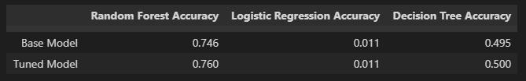

# Data Bootcamp Final Project
## In associate with: Catherine, Hayley, Nasrin and Franco

This project aim to predict the housing price in Melbourne Metro using Machine Learning on a dataset includes data from 2016 to 2018(from Kaggle).
The analysis is based on 4 factors that could potentially affect the house price:

1. Distance between the suburb and Melbourne CBD, many of us would imagine the house price would be higher when it get closer to the CBD. We are hoping to find out the relationship between distance and house price

2. School network, many people move to a particular suburb because of school network. The analysis should be able to give us an answer to see will the number of school affect the house price.

3. Crime rate, a suburb with high crime rate cannot provide the resident sense of security to the residents, thus not many would like to move in. This is a critical element to affect house price. 3 years of data was analized to try find out the relationship between crime rate and house price

4. Transport, this analysis is focus on the surrounding train station of a suburb in a 3KM radius. Will the house worth more when there's more train station around?

## A simple web page is created for users to put in the selected feathure to show the predicted price.

### Data Cleaning
For the model to learn and train properly, all 0 and NaN are removed from the dataset.

### Machine Learning
3 different ML models were made, Decision Tree, Logistic Regression and Random Forest. As the Random Forest model gets the highest accuracy point the project would use the this model for prediction. The predicted price is then added to the original dataset for visulization

### Visualization
Tableau is used for visualization for all different features.