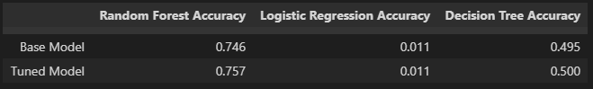

# Data Bootcamp Final Project : Real Estate House Price Prediction Website
## In associate with: Catherine, Hayley, Nasrin and Franco

House Price Prediction using Machine Learning Algorithm
In this project, we are aiming to predict the housing price in Melbourne Metro using Machine Learning to predict house prices based on various factors. The dataset that we are using includes the house selling data from 2016 to 2018(from Kaggle).
As we all know that real estate is always a hot topic in Australia. We are interested in understanding the value of house price as it's highly believed that a house value is more than just the location or the landsize. With the dataset that we have, we are going to incorporate all the features to understand the relationship between them. 

### Problem Statament
The goal of this analysis is to help us understand the relationship between different house features and how they are used to predict house price.

### The benefits of Data Science in Real Estate Analysis
1. For home buyers, they can use this to check a predictive market prices based on their own ideal requirement (/features) of future house. 

2. For seller, this can help them to estimate the price of properties with the help of historical data. 

3. For real estate agent, this allows them to provide their customer with more information based on the Machine Learning algorithm. Also, it helps them to plan marketing strategy according to their customer needs.

### Hypothesis
The analysis is based on the factors that could potentially affect the house price:
1. Distance between the suburb and Melbourne CBD: 
   Hypothesis - The distance from CBD has direct correlation to house prices regardless of the region. 
	
2. Nearby Schools:
   Hypothesis - Higher demand exists in suburbs with more schools in neighborhood. This is especially important for young families. Hence, it will drive the house prices.

3. Crime rate: 
   Hypothesis - Crime rate affects the market prices indirectly as people would prefer to live in suburb that is safe and secure. 3 years of data was analized to try find out the relationship between crime rate and house price.

4. No of Rooms / Bathrooms / Car park
   Hypothesis - Either of these features have direct impact on the house prices.

### Operating environment
1. Launguage - Python / Javascript / HTML / CSS3
2. Server - Python / Flask
3. Visualisation - Tableau
4. User - Web Browser

### Data Cleaning
For the model to learn and train properly, all 0 and NaN are removed from the dataset.

### Machine Learning
3 different ML models were made, Decision Tree, Logistic Regression and Random Forest. As the Random Forest model gets the highest accuracy point the project would use the this model for prediction. The predicted price is then added to the original dataset for visulization

### Visualization
Tableau is used for visualization for the relationship between the features and the house prices. 
We also used it to compare the results between the Actual Prices and Prediction Prices

## As the final outcome, a simple web page is built for users to enter input (features) to predict house prices.
### Application
We used python and flask to build the website and testing the results. We created a JSON map of features and values to allow user to freely choose. Once they make the request, the application will receive and return a response containing the predicted price.

## Results and Discussion
### Screenshot of the application

## Limitation

## Conclusion

## References